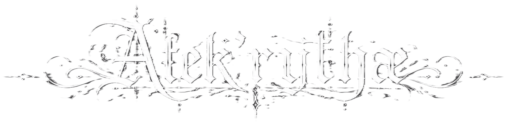

 

> *“A traveler through the distant realms of Alekrythae, guided by the enduring patterns of the Algorithm and the echoes of forgotten legends. I do not merely write; through the elegance of the Primordial Code, I seek to reveal worlds buried beneath the silence of ages and hidden beyond the gaze of fading stars.”*

# ⚠ Proprietary Source-Available Software

This repository is NOT open-source.

Unauthorized copying, modification, redistribution, AI training, dataset usage, commercialization, or derivative development is strictly prohibited under the SP-SAL v4.0 License.

# STRICT PROPRIETARY SOURCE-AVAILABLE LICENSE (SP-SAL)

## Version 4.0

Copyright (c) 2026 TheDevorger. All Rights Reserved.

IMPORTANT LEGAL NOTICE

THIS REPOSITORY, SOFTWARE, AND ALL ASSOCIATED MATERIALS ARE PROPRIETARY AND SOURCE-AVAILABLE.

THIS IS NOT OPEN-SOURCE SOFTWARE.

NO RIGHTS OR LICENSES ARE GRANTED EXCEPT THOSE EXPRESSLY PROVIDED UNDER THIS LICENSE.

BY ACCESSING, VIEWING, DOWNLOADING, FORKING, CLONING, INSTALLING, COMPILING, EXECUTING, COPYING, OR OTHERWISE INTERACTING WITH THE SOFTWARE, YOU AGREE TO BE LEGALLY BOUND BY THIS LICENSE.

IF YOU DO NOT AGREE TO THESE TERMS, YOU MUST IMMEDIATELY CEASE ACCESS AND DESTROY ALL COPIES OF THE SOFTWARE IN YOUR POSSESSION OR CONTROL.

YOU REPRESENT AND WARRANT THAT:

YOU POSSESS THE LEGAL CAPACITY, AUTHORITY, AND LEGAL AGE REQUIRED TO ENTER INTO THIS LICENSE;
YOU ARE NOT PROHIBITED FROM RECEIVING OR USING THE SOFTWARE UNDER APPLICABLE LAW;
IF ACTING ON BEHALF OF AN ENTITY OR ORGANIZATION, YOU POSSESS FULL AUTHORITY TO LEGALLY BIND SUCH ENTITY.

YOUR ACCESS OR USE OF THE SOFTWARE CONSTITUTES ELECTRONIC ACCEPTANCE OF THIS LICENSE AND CREATES A LEGALLY BINDING AGREEMENT.

────────────────────────────────────────────────────────

1. DEFINITIONS
1.1 “Software”

“Software” includes, without limitation:

* Source code;
* Object code;
* Executables, binaries, and compiled artifacts;
* Scripts, APIs, middleware, frameworks, orchestration systems, backend infrastructure, pipelines, and runtime systems;
* Databases, schemas, procedural systems, rendering systems, execution systems, and automation systems;
* Tools, launchers, SDKs, plugins, utilities, and development resources;
* User interfaces, workflows, interaction systems, menus, layouts, UX systems, and visual structures;
* Artwork, textures, models, graphics, visual assets, animations, shaders, symbols, logos, designs, and branding assets;
* Audio assets, sound effects, voice assets, music, and sound design;
* Documentation, diagrams, technical materials, blueprints, specifications, and design documents;
* Lore, terminology, narrative structures, fictional universes, characters, factions, mythology, locations, dialogue, naming systems, symbolic systems, and worldbuilding methodologies;
* Prompt structures, semantic systems, contextual architectures, AI orchestration logic, procedural generation systems, and associated logic;
* Any updates, patches, modifications, expansions, future releases, forks, derivatives, or associated materials.

This includes, but is not limited to, all intellectual property associated with:

TheDevorger;
Alekrythae;
HawenForge;
Protocol Alakrytha;
Any associated fictional universes, brands, symbols, aesthetics, or visual identities.
1.2 “Licensor”

“Licensor” refers exclusively to TheDevorger, the sole legal owner and copyright holder of the Software.

1.3 “You”

“You” refers to any individual, company, organization, institution, automated system, AI system, machine learning system, government entity, or agent accessing or interacting with the Software.

────────────────────────────────────────────────────────

2. OWNERSHIP AND INTELLECTUAL PROPERTY

The Software and all associated rights, including but not limited to copyrights, trademarks, trade dress, patents, trade secrets, neighboring rights, database rights, moral rights, publicity rights, and all other intellectual property rights, remain exclusively owned by the Licensor.

No ownership rights are transferred under this License.

No implied licenses shall exist under this License, whether by implication, estoppel, exhaustion, waiver, custom, or otherwise.

All rights not expressly granted are fully reserved by the Licensor.

────────────────────────────────────────────────────────

3. LIMITED LICENSE GRANT

Subject to strict compliance with this License, the Licensor grants you a limited, revocable, non-exclusive, non-transferable, non-assignable, and non-sublicensable license solely to:

View and study the Software for personal and educational purposes;
Download, compile, and execute the Software locally for strictly personal, private, and non-commercial use;
Fork the repository exclusively through GitHub platform functionality for archival or reference purposes, provided such fork remains fully subject to this License.

No additional rights are granted.

No rights are granted for:

Commercial usage;
Public deployment;
Redistribution;
Hosting;
SaaS usage;
Streaming;
Monetization;
Public display;
Public performance;
Derivative development;
AI-related usage.

For purposes of this License, commercial use includes, but is not limited to:

* Monetized videos, streams, or social media content;
* Sponsored or promotional usage;
* Corporate, enterprise, institutional, or organizational usage;
* Internal business research or development;
* Portfolio usage intended for professional advancement or employment opportunities;
* Revenue-generating services, subscriptions, or advertisement-supported platforms.

The Licensor reserves the right to revoke or terminate this License immediately upon any breach.

────────────────────────────────────────────────────────

4. PROHIBITED ACTIVITIES

Unless expressly authorized in prior written permission signed by the Licensor, you may NOT, directly or indirectly:

Copy, reproduce, mirror, archive, scrape, harvest, extract, or reuse any portion of the Software;
Modify, adapt, alter, translate, transform, or create derivative works;
Reverse engineer, decompile, disassemble, decode, analyze, or derive source logic from compiled components;
Use decompilers, reflection tools, debuggers, intermediate-language reconstruction tools, memory inspection tools, or similar technologies to reconstruct source logic from binaries regardless of purpose;
Redistribute, sublicense, lease, rent, sell, host, deploy, transmit, or make the Software available to third parties;
Use the Software in commercial, monetized, enterprise, business-related, or revenue-generating activities;
Incorporate the Software into another product, dataset, framework, engine, platform, or service;
Create clones, remakes, adaptations, emulations, recreations, fan-games, spin-offs, or competing products;
Remove, obscure, bypass, alter, or falsify copyright notices, proprietary notices, watermarks, attribution notices, or branding;
Use the Software for benchmarking, competitive analysis, replication, substitution, or intelligence gathering;
Claim ownership, affiliation, sponsorship, endorsement, or association with the Software or Licensor;
Recreate or imitate the Software’s distinctive aesthetics, branding, lore, fictional systems, terminology, naming structures, or artistic identity;
Circumvent or interfere with technical protections, access restrictions, telemetry systems, watermarking systems, or security systems;
Use the Software in unlawful, deceptive, abusive, harmful, malicious, or fraudulent activities.

────────────────────────────────────────────────────────

5. ACCEPTABLE USE RESTRICTIONS

You may not use the Software in connection with:

Malware, spyware, ransomware, botnets, or malicious infrastructure;
Unauthorized surveillance, tracking, or data harvesting;
Harassment, impersonation, fraud, abuse, or deception;
Violations of privacy, intellectual property, or applicable law;
Military systems, autonomous weapons, unlawful cyber operations, or offensive security operations;
High-risk systems where failure may result in death, injury, environmental damage, or severe harm;
Any activity intended to damage the Licensor, the Software ecosystem, or associated intellectual property.

────────────────────────────────────────────────────────

6. AI, MACHINE LEARNING, AND DATA MINING RESTRICTIONS

Under no circumstances may the Software or any associated materials be used, directly or indirectly, for:

Training, fine-tuning, aligning, optimizing, evaluating, distilling, or developing artificial intelligence or machine learning systems;
Training or fine-tuning large language models (LLMs), multimodal systems, diffusion systems, neural networks, or generative systems;
Dataset creation, augmentation, indexing, embedding extraction, vectorization, semantic parsing, tokenization, or redistribution;
Retrieval-Augmented Generation (RAG), vector databases, semantic search systems, memory systems, or knowledge indexing systems;
Automated reasoning extraction, topology mapping, procedural replication, behavioral imitation, or prompt synthesis;
Automated code generation systems, copilots, synthetic media systems, or autonomous agents;
Web scraping, crawling, corpus harvesting, automated parsing, or automated ingestion;
AI benchmarking, evaluation suites, synthetic training pipelines, or machine learning research;
Any attempt to emulate, imitate, reproduce, compete with, or derive value from the Software through automated systems.

These prohibitions apply regardless of whether the Software-derived data is transformed, anonymized, compressed, tokenized, paraphrased, embedded, reconstructed, modified, or otherwise altered before ingestion into automated systems.

These restrictions apply to:

Commercial systems;
Academic systems;
Government systems;
Open-source systems;
Research systems;
Non-commercial systems;
Private systems.

Any unauthorized retention, storage, indexing, or ingestion of Software-derived data must be permanently deleted immediately upon request by the Licensor.
The absence of technical restrictions, robots.txt directives, metadata markers, or automated access barriers shall not be interpreted as permission to use the Software for AI-related purposes.

Any circumvention or disregard of "no-ai" directives, metadata, crawler restrictions, or similar technical measures constitutes a direct violation of this License.

────────────────────────────────────────────────────────

7. ARTWORK, BRANDING, AND WORLDBUILDING PROTECTION

All artwork, visual identity, narrative systems, lore, fictional universes, terminology, aesthetics, symbols, naming systems, artistic methodologies, graphical systems, branding elements, and worldbuilding structures associated with the Software are protected intellectual property.

No trademark rights, merchandising rights, commercialization rights, publicity rights, branding rights, or derivative aesthetic rights are granted.

You may not:

Use project names, symbols, logos, slogans, or branding assets;
Recreate or imitate the Software’s artistic identity or distinctive aesthetics;
Use associated fictional universes, terminology, factions, characters, mythology, or lore in public-facing projects;
Present derivative aesthetics intended to imply affiliation with the Licensor.

────────────────────────────────────────────────────────

8. TRADEMARKS

TheDevorger, Alekrythae, HawenForge, Protocol Alakrytha, and all associated names, identifiers, symbols, marks, logos, slogans, and branding elements are proprietary trademarks or protected identifiers of the Licensor, whether registered or unregistered.

No rights are granted to use such marks without prior written authorization from the Licensor.

────────────────────────────────────────────────────────

9. THIRD-PARTY SOFTWARE

The Software may include or interact with third-party software components licensed under separate terms.

Such components remain the property of their respective owners.

Nothing in this License replaces, overrides, or modifies third-party license obligations.

────────────────────────────────────────────────────────

10. CONTRIBUTIONS

Unless otherwise explicitly agreed in writing by the Licensor:

Any contribution, issue submission, pull request, suggestion, optimization, patch, feedback, or submitted material becomes the exclusive property of the Licensor;
You irrevocably assign all worldwide rights, title, and interest in such contributions to the Licensor to the maximum extent permitted by law;
You waive all attribution rights, compensation rights, royalty rights, moral rights, and future payment claims related to such contributions.

You represent and warrant that any contribution:

Is your original work;
Does not infringe third-party rights;
Does not violate applicable law.

Temporary local modifications strictly necessary for preparing contributions are permitted, provided they are not independently redistributed or used.

────────────────────────────────────────────────────────

11. EXPORT CONTROL AND SANCTIONS

You agree not to use, export, re-export, transfer, or make available the Software in violation of any applicable export control laws, sanctions laws, or regulations.

You represent and warrant that you are not located in, organized under the laws of, or acting on behalf of any sanctioned or embargoed jurisdiction, entity, or individual.

────────────────────────────────────────────────────────

12. TERMINATION

This License automatically and immediately terminates upon any breach.

Upon termination, you must immediately:

Cease all use of the Software;
Destroy all copies under your possession or control;
Remove all hosted, mirrored, archived, cached, or locally stored instances;
Cease all use of Software-derived materials.

Sections relating to ownership, AI restrictions, trademarks, branding protection, disclaimers, indemnification, limitations of liability, jurisdiction, equitable relief, and reserved rights shall survive termination indefinitely.

────────────────────────────────────────────────────────

13. DISCLAIMER OF WARRANTIES

THE SOFTWARE IS PROVIDED “AS IS,” “WITH ALL FAULTS,” AND “AS AVAILABLE,” WITHOUT WARRANTY OF ANY KIND.

TO THE MAXIMUM EXTENT PERMITTED BY LAW, THE LICENSOR DISCLAIMS ALL WARRANTIES, WHETHER EXPRESS, IMPLIED, STATUTORY, OR OTHERWISE, INCLUDING BUT NOT LIMITED TO WARRANTIES OF:

MERCHANTABILITY;
FITNESS FOR A PARTICULAR PURPOSE;
NON-INFRINGEMENT;
TITLE;
SECURITY;
RELIABILITY;
ACCURACY;
PERFORMANCE;
AVAILABILITY;
COMPATIBILITY.

THE LICENSOR DOES NOT WARRANT THAT THE SOFTWARE WILL BE ERROR-FREE, SECURE, UNINTERRUPTED, OR SUITABLE FOR ANY PURPOSE.

────────────────────────────────────────────────────────

14. LIMITATION OF LIABILITY

TO THE MAXIMUM EXTENT PERMITTED BY APPLICABLE LAW, IN NO EVENT SHALL THE LICENSOR BE LIABLE FOR ANY DIRECT, INDIRECT, INCIDENTAL, SPECIAL, EXEMPLARY, PUNITIVE, CONSEQUENTIAL, OR OTHER DAMAGES ARISING FROM OR RELATED TO:

USE OF THE SOFTWARE;
INABILITY TO USE THE SOFTWARE;
SYSTEM FAILURE;
DATA LOSS;
SECURITY BREACHES;
BUSINESS INTERRUPTION;
DEVICE DAMAGE;
HARDWARE FAILURE;
NETWORK FAILURE;
LOSS OF PROFITS;
LOSS OF GOODWILL;
FILE CORRUPTION;
SOFTWARE CONFLICTS;
OR ANY OTHER DAMAGES OR LOSSES.

THIS LIMITATION APPLIES REGARDLESS OF LEGAL THEORY, INCLUDING CONTRACT, TORT, NEGLIGENCE, STRICT LIABILITY, OR OTHERWISE.

────────────────────────────────────────────────────────

15. INDEMNIFICATION

You agree to defend, indemnify, and hold harmless the Licensor from and against any claims, liabilities, damages, losses, costs, judgments, expenses, and legal fees arising from:

Your violation of this License;
Your misuse of the Software;
Your unauthorized modification or distribution of the Software;
Your infringement of third-party rights.

────────────────────────────────────────────────────────

16. GOVERNING LAW AND JURISDICTION

This License shall be governed and interpreted under the laws of the Republic of Türkiye, excluding conflict-of-law principles.

Any dispute, controversy, or legal proceeding arising from or relating to this License shall be subject exclusively to the competent courts and execution offices located in Istanbul, Türkiye.

────────────────────────────────────────────────────────

17. LANGUAGE

This License is written in English.

Any translated version is provided solely for convenience and informational purposes.

To the maximum extent permitted by applicable law, the English version shall prevail in the event of any conflict, inconsistency, ambiguity, or discrepancy.

────────────────────────────────────────────────────────

18. INJUNCTIVE AND EQUITABLE RELIEF

You acknowledge that any breach of this License may cause irreparable harm to the Licensor for which monetary damages would be inadequate.

Accordingly, the Licensor shall be entitled to seek immediate injunctive relief, equitable relief, specific performance, and all other available remedies without the necessity of posting bond or proving actual damages.

────────────────────────────────────────────────────────

19. FORCE MAJEURE

The Licensor shall not be liable for delays or failures resulting from causes beyond reasonable control, including natural disasters, cyberattacks, infrastructure failures, internet outages, labor disputes, governmental actions, war, terrorism, or force majeure events.

────────────────────────────────────────────────────────

20. SEVERABILITY

If any provision of this License is determined to be invalid, illegal, or unenforceable, the remaining provisions shall remain in full force and effect.

────────────────────────────────────────────────────────

21. NO WAIVER

Failure of the Licensor to enforce any provision of this License shall not constitute a waiver of any rights.

Any waiver must be explicit, written, and signed by the Licensor.

────────────────────────────────────────────────────────

22. FUTURE REVISIONS

The Licensor reserves the right to publish revised versions of this License for future releases of the Software.

Revised versions apply only to future releases unless explicitly stated otherwise.

────────────────────────────────────────────────────────

23. ENTIRE AGREEMENT

This License constitutes the complete and exclusive agreement between the parties concerning the Software and supersedes all prior understandings, communications, negotiations, or agreements relating thereto.

────────────────────────────────────────────────────────

24. CONTACT INFORMATION

For permissions, licensing inquiries, legal notices, or authorization requests:

ayberkerdem.dev@hotmail.com

The Licensor reserves the right to refuse any request at its sole discretion.

────────────────────────────────────────────────────────

25. RESERVATION OF RIGHTS

All rights not expressly granted under this License are fully and exclusively reserved by the Licensor.

────────────────────────────────────────────────────────

END OF LICENSE

---

